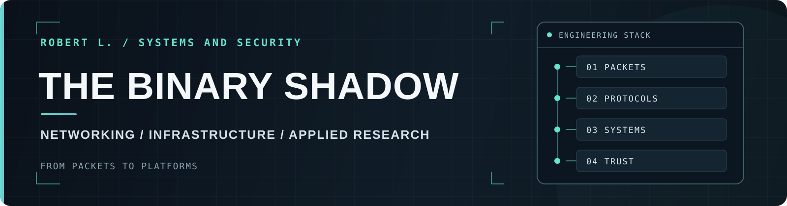

<picture>
  <source media="(prefers-color-scheme: dark)" srcset="./assets/profile-hero-dark.svg">
  <source media="(prefers-color-scheme: light)" srcset="./assets/profile-hero-light.svg">
  
</picture>

# Robert L.

**Founder and CTO at [QInformed](https://qinformed.com/). Founder and CEO at [Binary Shadow](https://bshadow.us/).**

Deep in the stack.

Operating-system internals, exploit development, vulnerability research, memory corruption, trust-boundary analysis and adversarial security engineering, networks, protocol internals, data encapsulation, operating-system internals, exploitation, infrastructure and security architecture...

## // Background

I come from a small European town located in the mountains.

Military family, which prompted me to leave the keyboard and try serving my country. 
Decided to leave for the private sector, though stayed close by.

My work spans cybersecurity, systems engineering, infrastructure, software, networking and technical leadership.

I have worked across commercial, regulated, government, defense, intelligence and allied national-security environments, from architecture and engineering through incident response and production operations. It included many field assignments, though these days I am mostly tied to my office day-to-day.

## // Engineering Approach

I start with the behavior below the product boundary: packets, protocol state, process lifetimes, I/O paths and trust assumptions. I test what the system actually does, then build upward toward reliable tools and infrastructure.

> **There is always another layer.**

My professional work spans commercial systems and high-assurance environments so much of it has no public artifact.

## // Outside the Terminal

Electronics, RF, amateur radio, automotive systems, mechanical engineering, music, visual design and keeping hardware and operating systems useful long after the industry has decided they should be dead.